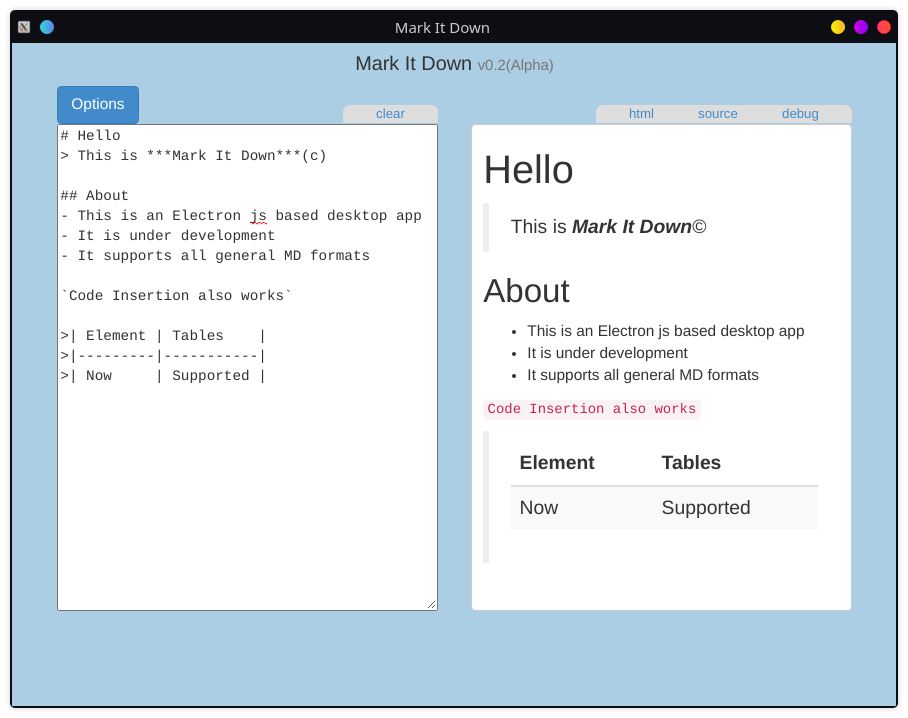
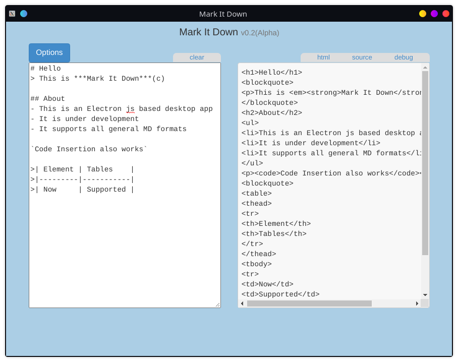
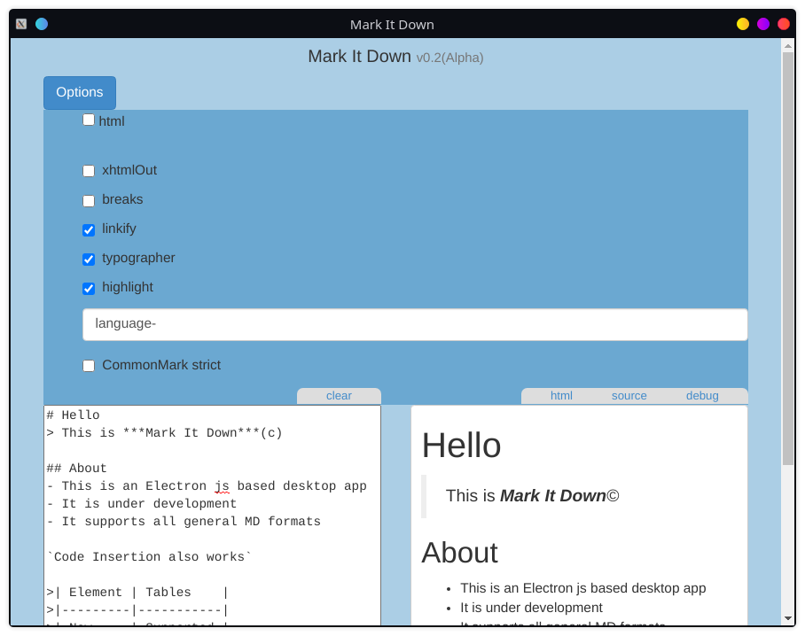

# Mark It Down (v0.2a)

## A simple Markdown editor made with Electron Js

This uses Markdown-It parser in the backend

### Installation instruction:

> **Method One**
>
> `Live Environment`
>
> - Clone the rpository and change into that directory
> - run npm install

> **Method Two**
>
> - `Using the installer bundle`
> - use one of the `releases` files for your platform
> - either run `npm run make` in cloned repo (requires rpmbuild binary) or

### Few features:

- Live Preview
  > 
- HTML source code generation
  > 
- Options Supported
  > 
